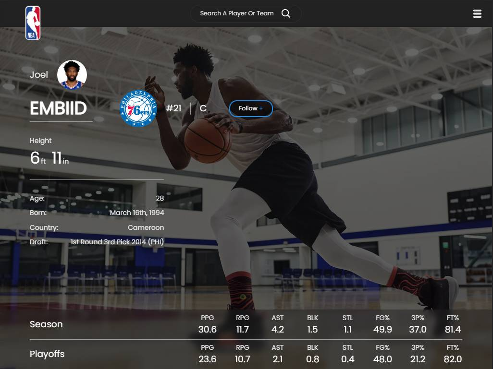
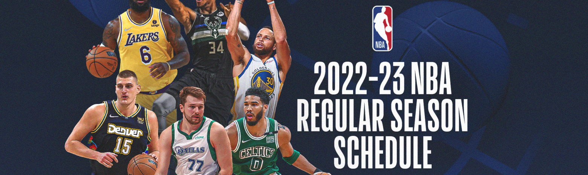

# **NBA League Data**

## Screenshots

## Optimizations

- **Responsive** on all devices (**_Mobile_**, **_Tablets_**, **_Desktops_**) ✅
- GetStaticProps (**Nextjs**) ✅
- **Hidden** Host & Key (**_process.env_**) ✅
- Optimized Images via **nextjs** ✅
- **Adobe Photoshop 2022** was used to add **curve, saturation, noise/distort** for **Team & Player Images** ✅
- **Search featured** added, clear search when value is **empty** and when **team** or **player** is clicked ✅
- Blurry loading screen with animations when page is loading ✅
- Beautiful UI Design inspired by [**Kostia Osadchy**](https://dribbble.com/shots/4747073-NBA-Player-Profile-Redesign)

## Lessons Learned

What did you learn while building this project? What challenges did you face and how did you overcome them?

## Acknowledgements

- [Kostia Osadchy](https://dribbble.com/shots/4747073-NBA-Player-Profile-Redesign)
- Big shoutout to Kostia Osadchy for the Web Design

## Authors

- [**@bird556**](https://github.com/bird556) 🙋‍♂️
